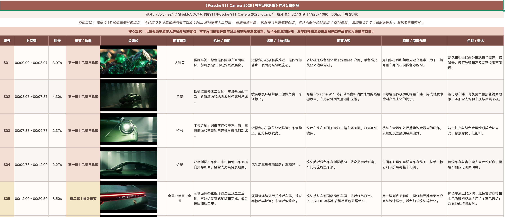
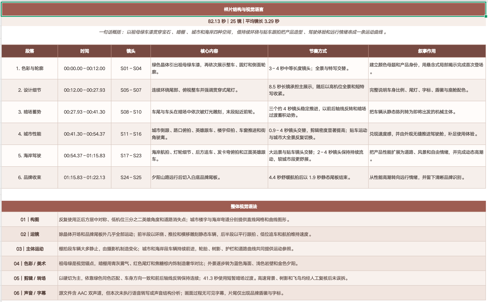
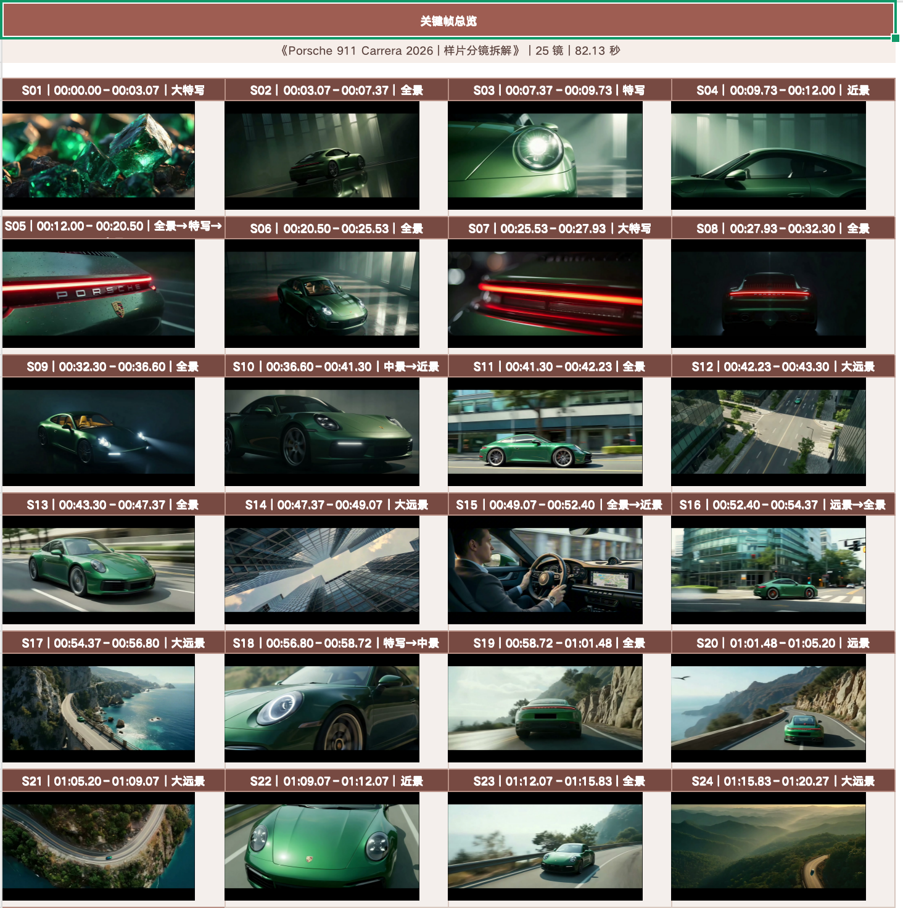

# Video Storyboard Breakdown

**视频分镜拉片拆解**是一个面向 Codex 的视频分析技能：从本地样片中识别可见剪辑点、提取逐镜关键帧，区分摄影机运动与主体运动，并生成带图片的专业分镜拆解 Excel。

适用于 MP4、MOV、MKV、M4V、AVI 和 WebM，常见使用场景包括拉片、样片拆解、逐镜分析、景别／机位／构图判断、运镜分析、剪辑节奏总结与视觉语言提炼。

<table>
  <tr>
    <td align="center" width="33%">
       
      分镜拆解
    </td>
    <td align="center" width="33%">
       
      结构与语言
    </td>
    <td align="center" width="33%">
       
      关键帧总览
    </td>
  </tr>
</table>

## 能做什么

- 上传提供样片，生成包含关键帧的三工作表 `.xlsx`：
  - `分镜拆解`
  - `结构与语言`
  - `关键帧总览`

## Excel 的三个功能工作表

以下截图来自 Porsche 911 Carrera 2026 样片拆解案例，分别展示最终 Excel 交付物的三个核心工作表。

### 1. 分镜拆解

主工作表按镜头逐行呈现镜号、时间码、时长、章节、关键帧、景别、机位／构图、运镜／主体运动、画面内容、剪辑作用和色彩／美术，可直接用于逐镜复盘与制作沟通。

### 2. 结构与语言

把逐镜结果归纳为叙事段落，集中展示每段的时间范围、镜头范围、核心内容、节奏方式和叙事作用，并总结构图、运镜、主体运动、色彩、剪辑与声音规律。

### 3. 关键帧总览

将所有代表性画面按镜号、时间码和景别排列成视觉索引，便于快速检查镜头覆盖、构图变化、色彩连续性与整体节奏。

## 工作流程

~~~mermaid
flowchart LR
    A[本地样片] --> B[候选切点检测]
    B --> C[关键帧与三帧对照]
    C --> D[人工复核与切点校正]
    D --> E[breakdown.json]
    E --> F[带关键帧的 Excel]
~~~

自动检测只负责提供候选点。最终镜头边界必须经过人工复核，不能把高速背景、闪光、树影、遮挡或主体运动直接当成剪辑。

## 安装

### 1. 安装为 Codex Skill

~~~bash
git clone https://github.com/fadeaway20242024/video-storyboard-breakdown.git \
  ~/.codex/skills/video-storyboard-breakdown
~~~

重新打开 Codex 会话后，可使用：

~~~text
$video-storyboard-breakdown
~~~

### 2. 运行依赖

- Python 3
- FFmpeg 与 FFprobe
- Pillow，用于生成联系表
- Node.js 与 `@oai/artifact-tool`，用于生成 Excel

macOS 可先安装媒体依赖：

~~~bash
brew install ffmpeg
python3 -m pip install Pillow
~~~

`build_storyboard_workbook.mjs` 使用 Codex 工作区提供的 `@oai/artifact-tool`。在 Codex 之外单独运行时，需要确保 Node.js 能解析该模块。

## 快速使用

### 在 Codex 中直接调用

~~~text
$video-storyboard-breakdown 请拆解参考视频，
输出带关键帧的分镜Excel
~~~

技能会依次完成媒体检查、候选切点检测、关键帧提取、人工判读、结构化分析和 Excel 验证。

### 只运行镜头提取脚本

~~~bash
python3 ~/.codex/skills/video-storyboard-breakdown/scripts/extract_shots.py \
  "/absolute/path/video.mp4" \
  --output-dir "/absolute/path/output"
~~~

默认场景检测阈值是 `0.18`。明显漏切时按 `0.15 → 0.12 → 0.10` 逐步降低；运动画面误切过多时按 `0.22 → 0.26 → 0.30` 提高。

### 使用人工切点重建

`cuts.json` 可以是内部切点秒数数组：

~~~json
[
  3.066667,
  7.366667,
  12.0
]
~~~

然后运行：

~~~bash
python3 ~/.codex/skills/video-storyboard-breakdown/scripts/extract_shots.py \
  "/absolute/path/video.mp4" \
  --cuts-file "/absolute/path/cuts.json" \
  --output-dir "/absolute/path/output-corrected"
~~~

### 根据分析数据生成 Excel

~~~bash
node scripts/build_storyboard_workbook.mjs \
  --input "/absolute/path/breakdown.json" \
  --output "/absolute/path/video_storyboard_breakdown.xlsx"
~~~

## 输出结构

~~~text
output/
├── analysis.json
├── analysis_frames/
│   ├── S01_start.jpg
│   ├── S01_end.jpg
│   └── ...
├── keyframes/
│   ├── S01_key.jpg
│   └── ...
└── contact_sheets/
    ├── 关键帧总览_01.jpg
    ├── 三帧对照_01-06.jpg
    └── ...

breakdown.json
影片名_分镜拆解.xlsx
~~~

`analysis.json` 保存检测结果和镜头边界；`breakdown.json` 保存人工判读后的导演级分析；Excel 是主要交付物。

## Excel 字段

| 字段 | 内容 |
|---|---|
| 镜号 | 从 S01 连续编号 |
| 时间码／时长 | 每镜准确起止时间与长度 |
| 章节／功能 | 镜头所属叙事段落 |
| 关键帧 | 最能代表本镜构图和目的的画面 |
| 画面景别 | 大远景、全景、中景、近景、特写等 |
| 机位／构图 | 高低机位、方向、图形关系和空间层次 |
| 运镜／主体运动 | 先写摄影机，再单独写主体动作 |
| 画面内容 | 只描述观众可见的事实 |
| 剪辑／叙事作用 | 解释镜头为何出现在这里 |
| 色彩／美术 | 主色、光线、服装、道具、材质和字体 |

## 仓库结构

~~~text
video-storyboard-breakdown/
├── SKILL.md
├── README.md
├── agents/
│   └── openai.yaml
├── assets/
│   └── reference.xlsx
├── docs/
│   └── images/
│       ├── porsche-911-sample-overview.jpg
│       ├── workbook-shot-breakdown.png
│       ├── workbook-structure-language.png
│       └── workbook-keyframe-overview.png
├── references/
│   ├── analysis-rubric.md
│   └── breakdown-schema.md
└── scripts/
    ├── extract_shots.py
    └── build_storyboard_workbook.mjs
~~~

## 判读原则

1. 按可见剪辑点拆镜，不按旁白句子或动作阶段臆断。
2. 先判断背景参照物是否移动，再区分摄影机运动和主体运动。
3. 关键帧优先选中段稳定帧；空间揭示镜头可改用结束构图。
4. 画面内容写可见事实，象征、情绪和功能放在剪辑栏。
5. 无法确认的细微运动使用“近似定机”“疑似轻微推近”等审慎措辞。

完整判读规范见 [analysis-rubric.md](references/analysis-rubric.md)，数据结构见 [breakdown-schema.md](references/breakdown-schema.md)。

## 注意事项

- 超过 15 分钟的视频建议分段检测，再合并为全局时间码。
- 叠化或淡变以视觉中点作为边界。
- 闪白、灯光突变、运动模糊和遮挡需要人工排除误切。
- 部分系统预览器不会显示 Excel 浮动图片；可检查工作簿 `xl/media` 和 drawing 锚点确认图片是否嵌入。
- 默认流程不执行语音转写。声音对叙事重要时，应另行分析旁白、环境音和音乐节拍。
